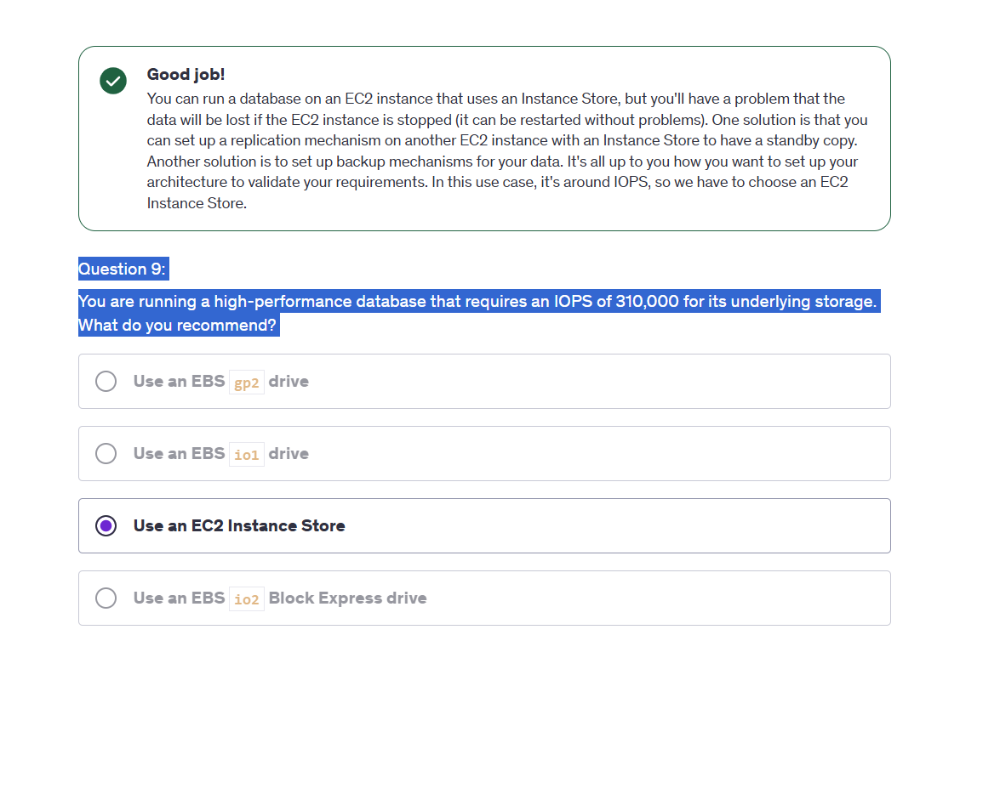

# AWS CloudFormation WordPress Deployment

## Overview

This project deploys a WordPress instance on AWS using CloudFormation. The live stack provisions an EC2 instance, installs Apache, PHP, MariaDB, and WordPress through user data, then creates a Route 53 health check for the HTTP endpoint.

A second stack uses a WordPress AMI to run a small development Auto Scaling group on a schedule.

## Architecture

The live deployment path is:

```text
CloudFormation -> Security Group + IAM Role -> EC2 WordPress instance
Route 53 Health Check -> WordPress HTTP endpoint
```

The development path is:

```text
Configured WordPress EC2 -> AMI -> Launch Template -> Auto Scaling Group
```

Architecture files are in `architecture/`:

- `architecture.mmd`
- `architecture.svg`

## Services Used

- AWS CloudFormation
- Amazon EC2
- Amazon VPC
- AWS IAM
- Amazon Machine Images
- Auto Scaling
- Route 53 Health Checks

## Deployment Steps

1. Deploy `cloudformation/wordpress-stack.yml` with an existing VPC, subnet, key pair, and admin CIDR.
2. Wait for the EC2 user data process to finish installing WordPress.
3. Open the stack output URL and complete the WordPress setup page.
4. Create an AMI from the configured WordPress instance.
5. Deploy `cloudformation/dev-wordpress-asg.yml` using the AMI ID.
6. Confirm the scheduled scaling settings match the intended development window.

Deploy live WordPress:

```powershell
cd scripts
.\deploy-live-stack.ps1 `
  -StackName wordpress-live `
  -VpcId vpc-xxxxxxxx `
  -SubnetId subnet-xxxxxxxx `
  -KeyName wordpress-key `
  -AdminCidr 203.0.113.10/32 `
  -WordPressDbPassword "replace-with-a-strong-password" `
  -Region us-east-1
```

Create an AMI:

```powershell
.\create-wordpress-ami.ps1 `
  -InstanceId i-xxxxxxxxxxxxxxxxx `
  -AmiName wordpress-dev-base `
  -Region us-east-1
```

Deploy the development stack:

```powershell
.\deploy-dev-asg.ps1 `
  -StackName wordpress-dev `
  -WordPressAmiId ami-xxxxxxxxxxxxxxxxx `
  -VpcId vpc-xxxxxxxx `
  -SubnetIds "subnet-xxxxxxxx,subnet-yyyyyyyy" `
  -KeyName wordpress-key `
  -Region us-east-1
```

## Troubleshooting

- If the WordPress page does not load, check the EC2 system log and confirm user data completed.
- If SSH fails, verify `AdminCidr` and the key pair name.
- If CloudFormation fails on the database password, confirm it meets the minimum length.
- If the development stack has no running instance, check the Auto Scaling desired capacity and scheduled action time.

## Screenshots

Storage selection reference:



## What I Learned

- CloudFormation makes a WordPress EC2 deployment repeatable.
- User data is useful for bootstrap tasks, but logs must be checked when package installs fail.
- Creating an AMI after configuration is a practical way to keep development environments consistent.
- Scheduled scaling helps reduce unnecessary EC2 runtime for non-production workloads.
