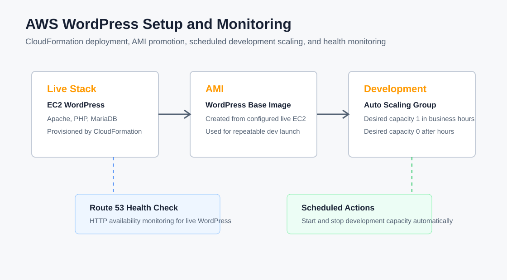
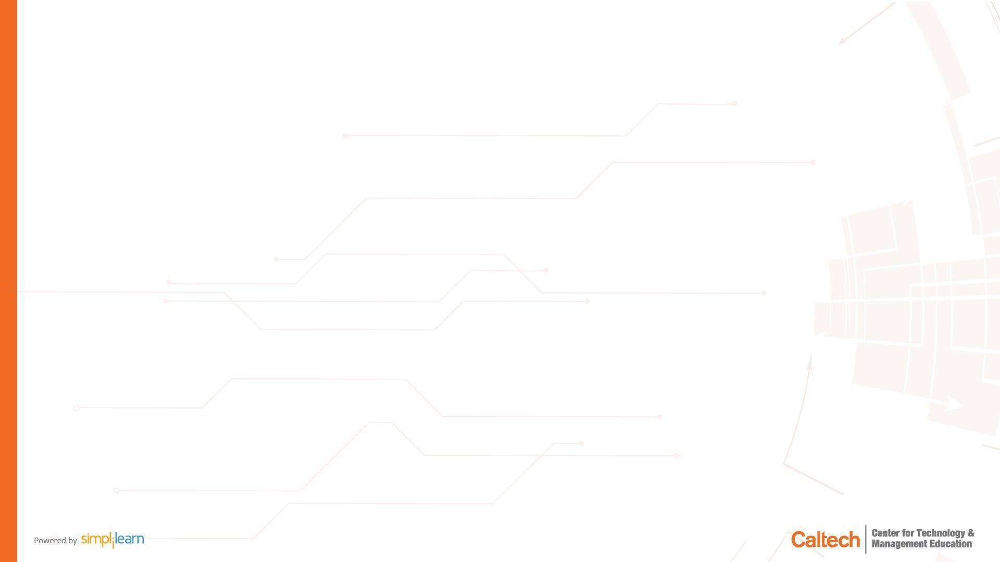

# Set Up and Monitor a WordPress Instance on AWS

This repository documents and automates the course-end project from the supplied PDF: configure a WordPress instance with AWS CloudFormation, create an AMI, launch a development WordPress instance with Auto Scaling, shut down the development instance outside business hours, and monitor availability with Route 53.

## Features

- CloudFormation template for a live WordPress EC2 instance
- Apache, PHP, MariaDB, and WordPress bootstrap through EC2 user data
- Route 53 HTTP health check for availability monitoring
- AMI creation script for the configured WordPress instance
- Auto Scaling group for the development WordPress environment
- Scheduled scaling actions for business-hours availability

## Tech Stack

- AWS CloudFormation
- Amazon EC2
- Amazon Machine Images
- Auto Scaling
- Route 53 Health Checks
- PowerShell

## Project Structure

```text
aws-wordpress-instance-monitoring/
|-- assets/
|   |-- architecture.svg
|   |-- pdf-page-8-image-1.jpg
|   |-- pdf-page-8-image-2.png
|   |-- pdf-page-8-image-3.png
|   |-- pdf-page-8-image-4.png
|   |-- pdf-page-8-image-5.png
|   `-- pdf-page-8-image-6.png
|-- cloudformation/
|   |-- dev-wordpress-asg.yml
|   `-- wordpress-stack.yml
|-- docs/
|   `-- inferred-components.md
|-- scripts/
|   |-- create-wordpress-ami.ps1
|   |-- deploy-dev-asg.ps1
|   `-- deploy-live-stack.ps1
`-- README.md
```

## Setup

Prerequisites:

- AWS account with permissions for EC2, IAM, CloudFormation, Auto Scaling, and Route 53 health checks
- AWS CLI configured locally
- Existing VPC, subnet, and EC2 key pair
- PowerShell

Deploy the live WordPress stack:

```powershell
cd scripts
.\deploy-live-stack.ps1 `
  -StackName wordpress-live `
  -VpcId vpc-xxxxxxxx `
  -SubnetId subnet-xxxxxxxx `
  -KeyName your-key-pair `
  -AdminCidr 203.0.113.10/32 `
  -WordPressDbPassword "replace-with-a-strong-password" `
  -Region us-east-1
```

Create an AMI from the live WordPress instance:

```powershell
.\create-wordpress-ami.ps1 `
  -InstanceId i-xxxxxxxxxxxxxxxxx `
  -AmiName wordpress-dev-base `
  -Region us-east-1
```

Deploy the development Auto Scaling group from the AMI:

```powershell
.\deploy-dev-asg.ps1 `
  -StackName wordpress-dev `
  -WordPressAmiId ami-xxxxxxxxxxxxxxxxx `
  -VpcId vpc-xxxxxxxx `
  -SubnetIds "subnet-xxxxxxxx,subnet-yyyyyyyy" `
  -KeyName your-key-pair `
  -Region us-east-1
```

## Architecture

The live environment runs WordPress on a single EC2 instance provisioned by CloudFormation. The instance installs Apache, PHP, MariaDB, and WordPress through user data, then exposes HTTP on port 80. Route 53 monitors the public HTTP endpoint with a health check.

After the live WordPress instance is configured, an AMI is created from it. The development environment uses that AMI in an Auto Scaling launch template. Scheduled Auto Scaling actions keep the development environment available during business hours and scale it down outside those hours.

## Screenshots

Architecture visual:



Screenshots extracted from the supplied PDF are stored in `assets/`. They are included as source evidence, but the PDF primarily contained project instructions rather than full console walkthrough screenshots.



## Deliverables Mapped to the Prompt

- Create a CloudFormation stack: `cloudformation/wordpress-stack.yml`
- Create an AMI of the WordPress instance: `scripts/create-wordpress-ami.ps1`
- Configure Auto Scaling to launch a new WordPress instance: `cloudformation/dev-wordpress-asg.yml`
- Configure automatic shutdown: Auto Scaling scheduled actions in `dev-wordpress-asg.yml`
- Monitor availability: Route 53 health check in `wordpress-stack.yml`

## Security Notes

- SSH access is restricted by `AdminCidr`.
- The instance role uses `AmazonSSMManagedInstanceCore` for managed access support.
- The WordPress database password is supplied through a `NoEcho` CloudFormation parameter.
